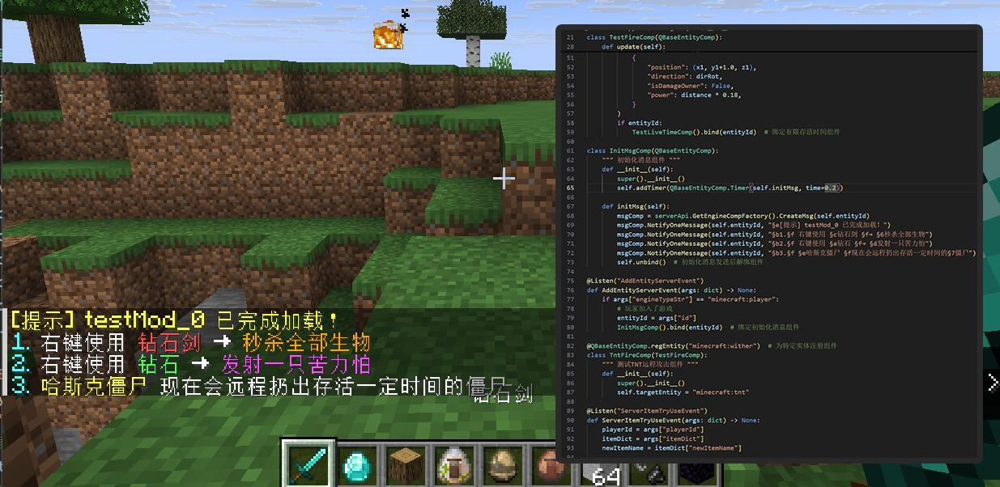

# PyScriptEngine
为 Minecraft Java MOD 提供嵌入式 Python 支持，允许直接使用Python开发MOD脚本。

> ⚠️ 该项目为实验性功能，主要用于功能验证和技术探索。部分功能可能会根据实际需求进行调整，仅供参考和学习。

**[By Zero123](https://space.bilibili.com/456549011)**

## 目录结构说明
- `cpp/*`: C++ 部分的实现细节，包括底层接口与 Python 的集成方式。
- `python/*`: Python 脚本Demo 及相关接口封装。
- `java/*`: Java 端与 MOD 相关的集成和调用方式。

如需了解各部分的具体实现和用法，请参考对应子目录下的 README 文件以及其源代码实现。



## PyMods 加载说明
引擎会自动加载 Minecraft 目录下 `pyMods` 文件夹内的Mod包。
```
.minecraft/
├─ mods/PyScriptEngine.jar
├─ pyMods/
│  └─ {ModName}/
│     └─ modMain.py
|      ...
```
> 测试版本：**1.21.7-NeoForge**

### 游戏日志
如果使用正式环境的jar包引擎开发测试，请在modMain.py文件启用局内游戏日志支持。
```python
# modMain.py
from mod.common.mod import Mod
import mod.server.extraServerApi as serverApi
import mod.client.extraClientApi as clientApi

try:
    # 启用游戏内日志支持(仅限PyScriptEngine, 官方Modsdk中并未提供此模块)
    import mod.gameLog
except:
    pass

@Mod.Binding("testMod1", "1.0.0")
class TestMod1(object):
    @Mod.InitServer()
    def initServer(self):
        serverApi.RegisterSystem("TestMod1", "TestServerSystem", "testMod_1.Server.TestSystem")

    @Mod.InitClient()
    def initClient(self):
        clientApi.RegisterSystem("TestMod1", "TestClientSystem", "testMod_1.Client.TestSystem")

    @Mod.DestroyServer()
    def serverDestroy(self):
        print("服务端销毁")

    @Mod.DestroyClient()
    def clientDestroy(self):
        print("客户端销毁")
```

## 解释器差异说明
`PyScriptEngine` 采用 **Python 3.12** 作为脚本解释器，与 **2.7.18** 存在部分差异。

### import 搜索机制
Python3 的模块相对导入更为严格，不再允许隐式导入：
```python
# Python2 相对导入:
from relModule import xxx   ✅
from .relModule import xxx  ✅
import relModule            ✅
from . import relModule     ✅

# Python3 相对导入:
from relModule import xxx   ❌
from .relModule import xxx  ✅
import relModule            ❌
from . import relModule     ✅
```

### print语句
在 Python3，print是一个标准函数而非语句：
```python
# Python2:
print "输出文本"                 ✅
print("输出文本, 括号自动折叠")   ✅

# Python3:
print "输出文本"                 ❌
print("正常函数调用，输出文本")   ✅
```

### 字符串
在 Python3，str默认基于unciode字符集，不再区分unicode字符串：
```python
# Python2:
a = "这是一个无编码字符串"
print(len(a))   # 输出内存中字节大小而不是字符数量，若需按字符处理需要转换u字符串

# Python3:
a = "这是一个Unicode字符集解析的字符串，默认就是有编码的"
print(len(a))   # 准确输出字符数量 无需额外转换
```

### 生成器
在 Python3，部分内置函数，方法将返回生成器对象而非拷贝的列表/元组：
```python
# Python2:
for i in range(100):
    # 先创建0-100的列表再遍历访问，有额外开销，若需生成器需使用 xrange()
    print(i)

a = dict()
# 以下方法将会构造列表并返回，因此在迭代的同时操作容器本身不会出现异常问题
a.items()
a.values()
a.keys()

# Python3:
for i in range(100):
    # 生成器而非列表，不会有额外的构造开销，同时废弃xrange()
    print(i)

a = dict()
# 同样是生成器，若在迭代的同时操作容器会破坏迭代器
a.items()
a.values()
a.keys()
```

### 兼容性建议
若需要确保代码的跨版本兼容性，请尽可能使用不同版本下表现一致的处理策略。